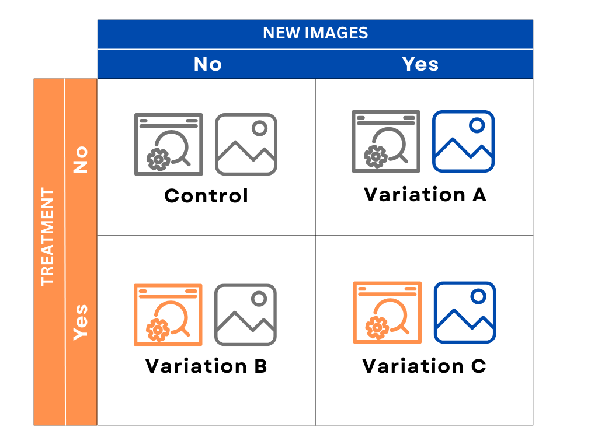

# Website Redesign: A/B/n Testing

## Executive summary:

This analysis conducts an A/B testing to find out whether the redesign of landing page and inclusion of new images increase the click-through rate (CTR).
Using Python for data cleaning, EDA and hypothesis testing through a Chi-Square and Two Proportion Z-Tests, it is observed that all 3 variations increase 
the CTR compared to control group (CTR = 10.71%). 

However **Variation B** with CTR of **12.00%** is statistically significant at 0.05 level of significance among all the variations. 
Therefore It is suggested that the company should **add new landing page but exclude new images** in it.

## Business Problem:

An early-stage startup in Germany aims to improve user acquisition by increasing the click-through rate (CTR) on its landing page. 
The design team has implemented a redesigned version of the page, expecting it to encourage more users to click through and join the platform. 
After conducting the test for several weeks, the company now needs to determine whether the observed increase in CTR is a result of the new design’s effectiveness or merely due to random variation. The goal is to statistically validate whether the redesign has a significant positive impact on click-through rate before rolling it out permanently.

### Goals:
  1) Analyze the conversion rates for each of the four groups: the new/old design of the landing page and the new/old pictures.
  2) Can the increases observed be explained by randomness? 
  3) Which version of the website should they use?

## Methodology:

  1) Cleaning data using python to check for null values, inconsistencies and to ensure correct data types  
  2) Performing EDA to check frequency distribution and calculating click-through rates across all variations and control group  
  3) Conducting a Chi-Square Test of Independence to check whether the difference between CTR across all groups are statistically significant  
  4) Performing a pairwise two-proportion Z-test to compare control group and each variation showed statistical significance

## Skills:

  - **Python :** Data Cleaning, EDA, Data Visualization  
  - **Statistics:** Hypothesis Testing: Chi-Square Test and Two Proportion Z-Test

## Results and Business Recommendation:

After comparing the CTR of all the variations to that of the control group, it is observed that the CTR of all variations are greater than the control group. 
This proves that the redesign of the website is a successful approach to boost CTR and, in turn, the number of people who join the site.

Exploratory analysis indicated that **Variation B (CTR = 12%)** has the highest CTR compared to the control group (10.71%), **Variation A (11.25%)**, and **Variation C (11.37%)**. 
To see if the differences were statistically significant, a Chi-square test of independence and two-proportion Z-tests were executed. 
The analysis indicated that Variation B alone had a statistically significant increase at the 0.05 level, meaning its improvement is not likely to occur by chance.

Based on this findings, it is recommended to implement new landing page with the old pictures i.e. **Variation B**
because it has the highest CTR and a statistically significant increase, which equals **12.00%** more than the control group.
